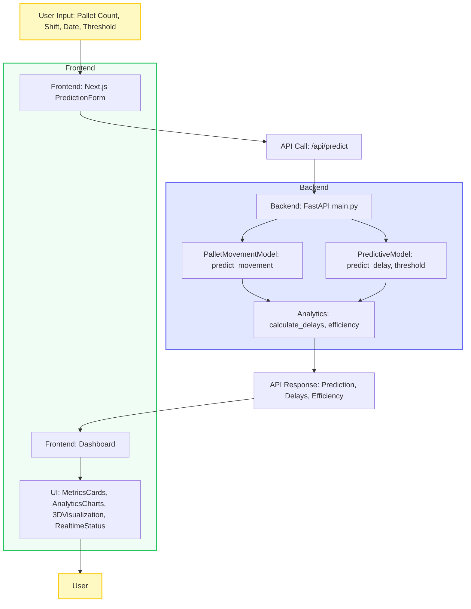
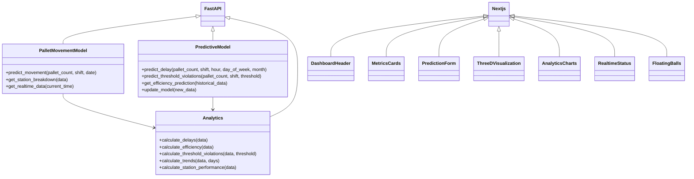
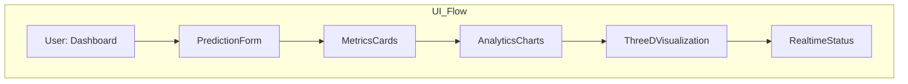

# Smart Factory Pallet Movement Predictive Diagnostics

## Overview
A comprehensive predictive diagnostics system for smart factory pallet movement with real-time analytics and elegant visualization.

---

## System Architecture & Flow

### High-Level Flowchart
```
[See below: System Flow Diagram]
```

### Code & Data Flow
- **User Input**: Pallet count, shift, date, threshold (via UI)
- **Frontend (Next.js)**: Handles UI, sends API requests, renders analytics, 3D graphs, and real-time status
- **Backend (FastAPI)**: Receives requests, runs prediction models, analytics, and returns results
- **ML Model**: Predicts delays, threshold violations, and efficiency
- **Visualization**: Data is shown as tables, charts, and 3D graphs

---

## Diagrams

### System Flow Diagram


### Backend Class & Component Diagram


### Prediction Math & Algorithm Flow
**See below for detailed math and formulas.**

### UI/UX Flow


---

## Prediction Math
- **Distribution**: 60% tube stations, 40% non-tube
- **Shift Efficiency**: Night 85%, Morning 95%, Afternoon 90%
- **Processing Time**: `count * station_time / efficiency`
- **Delay**: `max(0, actual_processing - base_processing)`
- **Threshold Violation**: If `pallets/hour > threshold`, flag as warning/critical
- **ML Model**: RandomForestRegressor for delay prediction

---

## Input & Output

### Input (via UI or API)
- Pallet count per shift (integer)
- Shift (night, morning, afternoon)
- Date (YYYY-MM-DD)
- Threshold (pallets/hour)

### Output (API Response)
- Prediction data (per station)
- Delays (total, max, average)
- Efficiency (overall, by station)
- Threshold violation status
- 3D coordinates for visualization
- Real-time status & alerts

---

## How to Run

### Backend
```bash
cd backend
pip install -r requirements.txt
uvicorn main:app --reload
```

### Frontend
```bash
cd frontend
npm install
npm run dev
```

### Access
- Open [http://localhost:3000](http://localhost:3000)

---

## Add More Features
- **Backend**: Add new endpoints in `main.py`, new models in `models/`, or analytics in `utils/`
- **Frontend**: Add new components in `frontend/components/`, update dashboard in `app/page.tsx`
- **Visualization**: Use Three.js for 3D, Chart.js for charts
- **ML**: Improve model in `predictive_model.py`, retrain with real data

### Example: Add a New Analytics Endpoint
```python
# In backend/main.py
@app.get("/api/new-analytics")
async def new_analytics():
    # Your logic here
    return {"result": "ok"}
```

### Example: Add a New Dashboard Card
```tsx
// In frontend/components/MetricsCards.tsx
metrics.push({
  title: 'New Metric',
  value: 123,
  icon: NewIcon,
  color: 'from-pink-500 to-yellow-500',
  ...
})
```

---

## Optimization Tips
- **Backend**: Use async endpoints, cache frequent queries, batch predictions
- **Frontend**: Use React.memo, lazy load heavy components, optimize 3D rendering
- **ML**: Retrain with real data, tune hyperparameters, monitor model drift
- **Deployment**: Use Docker, CI/CD, environment variables for config

---

## Contribution & Version Control
- Use `.gitignore` to avoid pushing unnecessary files (see included .gitignore)
- Use feature branches for new features
- PRs should include tests and updated docs

---

## Credits
- **Backend**: Python, FastAPI, Pandas, Scikit-learn
- **Frontend**: Next.js, React, Three.js, Chart.js, Tailwind CSS
- **Visualization**: 3D, charts, glassmorphism UI

---

## License
MIT 